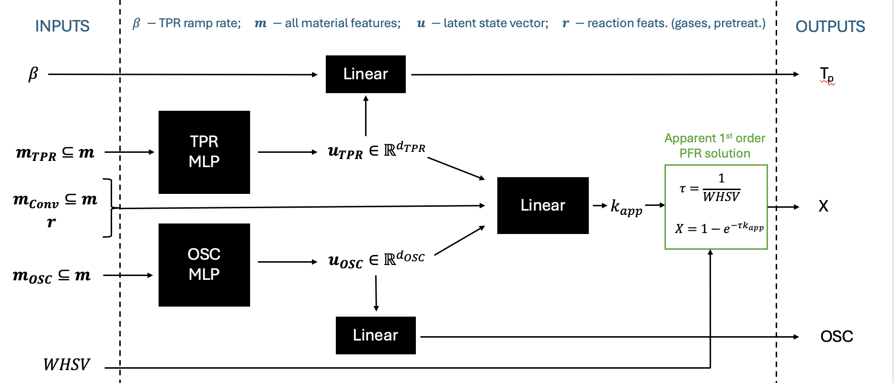

# Training an Extrapolatable Model for CO Oxidation Light-Off Prediction over Cerium-Based Catalysts
Extrapolatable NNs for CO Oxidation light-off prediction

The exact architecture can be dictated by the provided model configs. In the most physically-informed scenario, the archictecture includes latent states for both the H2-TPR and dynamic oxygen storage capacity (OSC), which are trained both on those experimental measurements and the conversion itself. The weight-hourly space velocity is not included in the features for the conversion net, rather is used to calculate conversion using the solution for a simple first-order kinetic model in a PFR. The conversion net therefore predicts the apparent rate constant (or rather, the log(kapp))

